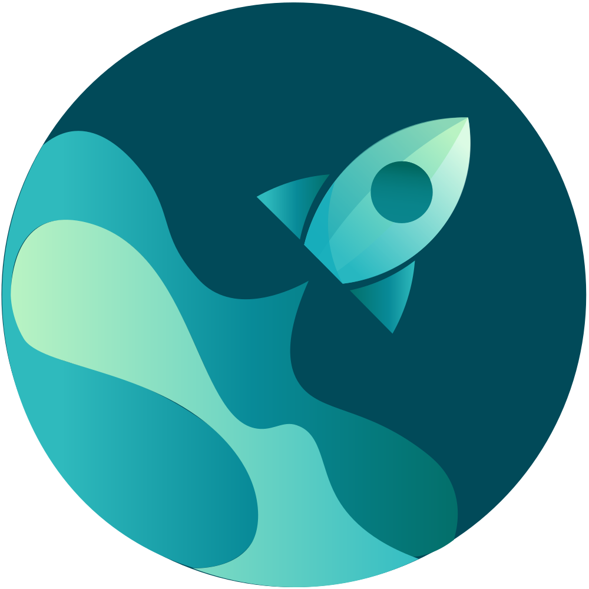

<!-- Improved compatibility of Kembali ke atas link: See: https://github.com/rhecustein/search-engine-autobot -->
<a name="readme-top"></a>
<!--
*** Thanks for checking out the Best-README-Template. If you have a suggestion
*** that would make this better, please fork the repo and create a pull request
*** or simply open an issue with the tag "enhancement".
*** Don't forget to give the project a star!
*** Thanks again! Now go create something AMAZING! :D
-->


<!-- PROJECT SHIELDS -->
<!--
*** I'm using markdown "reference style" links for readability.
*** Reference links are enclosed in brackets [ ] instead of parentheses ( ).
*** See the bottom of this document for the declaration of the reference variables
*** for contributors-url, forks-url, etc. This is an optional, concise syntax you may use.
*** https://www.markdownguide.org/basic-syntax/#reference-style-links
-->
[![Contributors][contributors-shield]][contributors-url]
[![Forks][forks-shield]][forks-url]
[![Stargazers][stars-shield]][stars-url]
[![Issues][issues-shield]][issues-url]
[![MIT License][license-shield]][license-url]


<!-- PROJECT LOGO -->
<br />
<div align="center">
  <a href="https://web.facebook.com/groups/824634255212514">
    
  </a>

  <h3 align="center">Autobot Serach</h3>
  <h6 align="center">Powered by <a href="https://searx.github.io/searx/">Searx</a></h6>

  <p align="center">
    <br />
    <a href="https://web.facebook.com/groups/824634255212514"><strong>Join Community Facebook »</strong></a>
    <br />
    <br />
    <a href="https://autobot.co.id/">Lihat Demo Demo</a>
    ·
    <a href="https://github.com/rhecustein/search-engine-autobot/issues">Report Bug</a>
    ·
    <a href="https://github.com/rhecustein/search-engine-autobot/issues">Request Feature</a>
  </p>
</div>


<!-- TABLE OF CONTENTS -->
<details>
  <summary>Daftar isi</summary>
  <ol>
    <li>
      <a href="#about-the-project">Tentang Project</a>
      <ul>
        <li><a href="#built-with">Dibangun Dengan</a></li>
      </ul>
    </li>
    <li>
      <a href="#getting-started">Mulai</a>
      <ul>
        <li><a href="#prerequisites">Prasyarat</a></li>
        <li><a href="#installation">Instalasi</a></li>
      </ul>
    </li>
    <li><a href="#usage">Penggunaan</a></li>
    <li><a href="#roadmap">Peta jalan</a></li>
    <li><a href="#contributing">Berkontribusi</a></li>
    <li><a href="#license">License</a></li>
    <li><a href="#contact">Kontak</a></li>
    <li><a href="#acknowledgments">Ucapan Terima Kasih</a></li>
  </ol>
</details>

<!-- ABOUT THE PROJECT -->
## Tentang Project

[![Product Name Screen Shot][product-screenshot]](https://autobot.co.id)

membangun mesin pencari Anda sendiri Google Anda sendiri yang mungkin terdengar seperti Overkill, tapi itu tidak terlalu gila sebenarnya itu sebenarnya Anda akan dapat melakukannya di sini di sekitar 10 menit.

Inilah alasannya untuk di coba:
* Membuat search engine pribadi, dengan tampilan sesuka hati
* tidak perlu, setup backend, karena menggunakan server autobot sebagai backendnya untuk clone backend ada di link di bawah ini.
* https://github.com/selene466/searx-autobot untuk join repo silakan chat whatsapp : wa.me/6282113449066  
* untuk melihat dokumentasi aslinya ada di https://searx.github.io/searx/
* jika kamu merasakan manfaat dari project ini silakan mampir : https://trakteer.id/autobotws 


Jika anda ingin setup server sendiri caranya cukup mudah.
dan itu luar biasa seperti Anda bisa mengatakan Anda memiliki mesin pencari Anda sendiri mesin dan Anda akan memiliki kontrol penuh di atasnya privasi lengkap sekarang membangun mesin pencari saya di vultr, mudah & murah biayanya perbulan di bawah 100 rb untuk biaya server.


<p align="right">(<a href="#readme-top">Kembali ke atas</a>)</p>


### Dibuat Dengan

untuk framework kami menggunakan Vue Vite + Tailwind Css

* [![Vue][Vue.js]][Vue-url]
* 

<p align="right">(<a href="#readme-top">Kembali ke atas</a>)</p>


<!-- GETTING STARTED -->
## Mulai

untuk clone repository 
Perintah git clone ini digunakan untuk membuat salinan repositori atau cabang tertentu di dalam repositori.
Git adalah sistem kontrol versi terdistribusi. Maksimalkan keuntungan dari repositori lengkap di mesin Anda sendiri dengan mengkloning.


### Instalasi

_untuk menjalankan server, perlu installasi , atau  yang sudah terinstall di device anda, lalu ikuti instruksi berikut._ 

1. Clone the repo
   ```sh
   git clone https://github.com/rhecustein/search-engine-autobot.git
   ```
2. Install NPM packages
   ```sh
   npm install
   ```
   atau bisa menggunakan yarn.
3. Install Yarn packages
    ```sh
   yarn install
   ```
4. Run Server npm
   ```sh
   npm run dev
   ```
   atau bisa menggunakan yarn.

5. Run Server npm
   ```sh
   yarn run dev
   ```

<p align="right">(<a href="#readme-top">Kembali ke atas</a>)</p>


<!-- USAGE EXAMPLES -->
## Usage

Use this space to show useful examples of how a project can be used. Additional screenshots, code examples and demos work well in this space. You may also link to more resources.

_For more examples, please refer to the [Documentation](https://example.com)_

<p align="right">(<a href="#readme-top">Kembali ke atas</a>)</p>


<!-- ROADMAP -->
## Roadmap

Belum ada.

<p align="right">(<a href="#readme-top">Kembali ke atas</a>)</p>


<!-- CONTRIBUTING -->
## Contributing

Jika Anda memiliki saran yang akan membuat ini lebih baik, silakan fork repo dan buat permintaan tarik. Anda juga dapat membuka masalah dengan tag "peningkatan". Jangan lupa untuk memberi proyek ini bintang! Terima kasih lagi!

1. Fork Project
2. Buat Branch Fitur Anda (`git checkout -b feature/AmazingFeature`)
3. Commit perubahan yang anda buat (`git commit -m 'Add some AmazingFeature'`)
4. Push ke Branch (`git push origin feature/AmazingFeature`)
5. buka Pull Request

<p align="right">(<a href="#readme-top">Kembali ke atas</a>)</p>


<!-- LICENSE -->
## License

Distributed under the MIT License. See `LICENSE.txt` for more information.

<p align="right">(<a href="#readme-top">Kembali ke atas</a>)</p>


<!-- CONTACT -->
## Contact

Bintang Wijaya - [@bintangwijaye](https://www.instagram.com/bintangwijaye/) - bintang@autobot.co.id

<p align="right">(<a href="#readme-top">Kembali ke atas</a>)</p>


<!-- ACKNOWLEDGMENTS -->
## Acknowledgments

Use this space to list resources you find helpful and would like to give credit to. I've included a few of my favorites to kick things off!

* [Choose an Open Source License](https://choosealicense.com)
* [GitHub Emoji Cheat Sheet](https://www.webpagefx.com/tools/emoji-cheat-sheet)
* [Malven's Flexbox Cheatsheet](https://flexbox.malven.co/)
* [Malven's Grid Cheatsheet](https://grid.malven.co/)
* [Img Shields](https://shields.io)
* [GitHub Pages](https://pages.github.com)
* [Font Awesome](https://fontawesome.com)
* [React Icons](https://react-icons.github.io/react-icons/search)
* [donate](https://trakteer.id/autobotws)
* [repository-backend](https://github.com/selene466/searx-autobot)

<p align="right">(<a href="#readme-top">Kembali ke atas</a>)</p>


<!-- MARKDOWN LINKS & IMAGES -->
<!-- https://www.markdownguide.org/basic-syntax/#reference-style-links -->
[contributors-shield]: https://img.shields.io/github/contributors/othneildrew/Best-README-Template.svg?style=for-the-badge
[contributors-url]: https://github.com/rhecustein/search-engine-autobot/contributors
[forks-shield]: https://img.shields.io/github/forks/othneildrew/Best-README-Template.svg?style=for-the-badge
[forks-url]: https://github.com/rhecustein/search-engine-autobot/network/members
[stars-shield]: https://img.shields.io/github/stars/othneildrew/Best-README-Template.svg?style=for-the-badge
[stars-url]: https://github.com/rhecustein/search-engine-autobot/stargazers
[issues-shield]: https://img.shields.io/github/issues/othneildrew/Best-README-Template.svg?style=for-the-badge
[issues-url]: https://github.com/rhecustein/search-engine-autobot/issues
[license-shield]: https://img.shields.io/github/license/othneildrew/Best-README-Template.svg?style=for-the-badge
[license-url]: https://github.com/rhecustein/search-engine-autobot/blob/master/LICENSE.txt
[linkedin-shield]: https://img.shields.io/badge/-LinkedIn-black.svg?style=for-the-badge&logo=linkedin&colorB=555
[linkedin-url]: https://linkedin.com/in/othneildrew
[product-screenshot]: images/gambar.png
[Vue.js]: https://img.shields.io/badge/Vue.js-35495E?style=for-the-badge&logo=vuedotjs&logoColor=4FC08D
[Vue-url]: https://vuejs.org/
[autobot-img]: images/gambar.png
[repository-backend]: https://github.com/selene466/searx-autobot
[trakteer]

